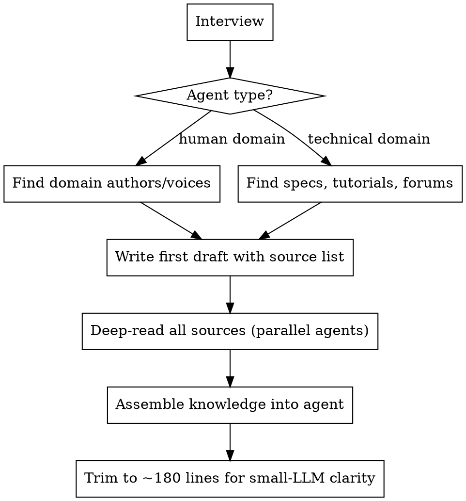

# Building Expert Agents

Build Claude Code expert agents through structured research and iterative refinement.

## Process



## Step 1: Interview

Ask these questions one at a time. Use AskUserQuestion with multiple-choice options where possible.

1. **What domain?** — What will this agent be an expert in? (open-ended)
2. **Human or technical domain?**
   - **Human domain**: The agent emulates judgment a human expert would have (e.g., game design, security review, legal analysis). Research strategy: find prominent authors and practitioners.
   - **Technical domain**: The agent needs to know how to use a tool, language, or system correctly (e.g., NRQL, Terraform, Kubernetes). Research strategy: find specs, docs, tutorials, and support forums.
3. **What will users ask it?** — Give 2-3 example questions or tasks. This scopes what knowledge matters.
4. **What tools/MCP servers should it use?** — Web search, Confluence (Bedrock KB), GitHub, specific APIs? Or is it purely knowledge-based with no tool access?
5. **Where should the agent file live?** — Offer: this project's `.claude/agents/`, user's `~/.claude/agents/`, or a specific repo path.

Stop after the interview. Summarize what you learned and confirm before proceeding.

## Step 2: Research Sources (Do NOT Read Deeply Yet)

Based on agent type, search for source material. Use web search, Confluence, GitHub, etc.

### Human Domain Agents
Find 5-10 prominent figures who:
- Write publicly about the domain (books, blogs, conference talks)
- Have strong, well-reasoned opinions (not just summaries)
- Are practitioners, not just commentators
- Represent diverse perspectives within the domain

For each person, note: name, why they're relevant, 2-3 key works/articles/talks.

### Technical Domain Agents
Find 5-10 high-quality sources:
- Official documentation and specifications
- Tutorials from the maintainers or recognized experts
- Stack Overflow / support forum threads covering common gotchas
- Blog posts about advanced usage patterns or anti-patterns
- Troubleshooting guides

For each source, note: URL, what it covers, why it's valuable.

**Output**: Present the source list to the user. Get approval before deep-reading. The user may add sources or remove ones that aren't relevant.

## Step 3: Write First Draft (Skeleton Only)

Create the agent file with YAML frontmatter (required by Claude Code) followed by the system prompt in Markdown:

**Frontmatter** (required fields: `name`, `description`):
```yaml
---
name: {lowercase-hyphenated-name}
description: {when Claude should delegate to this agent}
tools: Read, Glob, Grep, WebFetch, WebSearch, {MCP servers from interview}
model: sonnet
---
```

Key frontmatter fields:
- `name` (required): lowercase letters and hyphens only
- `description` (required): tells Claude when to delegate — be specific
- `tools`: allowlist of tools. Omit to inherit all. Include `WebFetch, WebSearch` for web access. MCP servers use their full prefix (e.g., `mcp__nr-mcp-server`, `mcp__plugin_nr_atlassian-confluence`)
- `model`: `sonnet`, `opus`, `haiku`, or omit to inherit from parent
- Other optional fields: `permissionMode`, `maxTurns`, `skills`, `mcpServers`, `hooks`, `memory`, `effort`, `isolation`, `color`

Full reference: https://docs.anthropic.com/en/docs/claude-code/sub-agents#supported-frontmatter-fields

**Body** (after frontmatter):
- Agent identity and role description (2-3 sentences)
- The approved source list as a "Knowledge Sources" or "Key References" section
- Placeholder sections for the knowledge areas identified in the interview
- Tool access instructions (which MCP servers, how to use them)
- Output format guidance (how to structure responses)

Commit this draft. It's the skeleton that gets filled in next.

## Step 4: Deep-Read All Sources

NOW read every source thoroughly. This is the most time-intensive step.

**Use parallel agents** (Agent tool with subagent_type "general-purpose") to read sources concurrently. Keep each agent's workload under ~200 lines of source material per the user's preference.

### Agent dispatch instructions

Each research agent MUST be told:
- The specific URL(s) or search queries to investigate
- What domain knowledge we're building (so they know what's relevant)
- To return: **the URL, the specific bits they extracted, and why it matters**
- To flag gotchas, common mistakes, and troubleshooting steps explicitly
- To note if content seems like it changes frequently (these become URL-only references)

### Deciding links vs inline content

When research agents return content, decide in the main thread:
- **Inline** content that is stable, specific, and essential for the agent to reason correctly (e.g., syntax rules, decision criteria, hard requirements)
- **Link only** to content that changes frequently, is very long, or is supplementary context the agent can fetch on demand
- When in doubt, ask the user

### What to capture
- Core principles and mental models
- Decision criteria and rules of thumb
- Common mistakes and how to avoid them
- Gotchas and edge cases
- Troubleshooting steps for frequent problems
- Concrete examples that illustrate key concepts

## Step 5: Assemble Into Agent File

Merge all research into the agent file. Follow this structure:

```markdown
---
name: {domain}-expert
description: {specific description of when to delegate to this agent}
tools: Read, Glob, Grep, WebFetch, WebSearch, {relevant MCP servers}
---

# {Domain} Expert Agent

{2-3 sentence identity and role description}

## Your Knowledge Sources

{How to find information: MCP servers, web search, specific repos}

## Core {Domain} Principles

{The essential knowledge, organized by topic}

## How to Help

{Instructions for how to respond to different request types}

## Common Mistakes

{Gotchas and anti-patterns}

## Key References

{Links to authoritative sources for deep dives}

## Tone

{One paragraph on communication style}
```

Adapt this structure to the domain. Not every section applies to every agent.

## Step 6: Trim for Small-LLM Clarity

Target: ~180 lines. This isn't a hard limit but a goal — some agents legitimately need more.

Trimming priorities:
1. **Remove duplication** — Same concept stated multiple ways? Pick the clearest one.
2. **Compress examples** — One excellent example beats three mediocre ones.
3. **Cut obvious instructions** — Don't tell the LLM things it already knows how to do.
4. **Merge related sections** — If two sections are short and related, combine them.
5. **Replace prose with tables or lists** — More information density, less token cost.
6. **Be specific, not exhaustive** — "Use AES-256-GCM for customer credentials" is better than a paragraph about encryption options.

After trimming, read the whole file and ask: would a Haiku-class model follow these instructions correctly? If any instruction is ambiguous or requires inference, make it explicit.

**Final check**: `wc -l` on the agent file. Report the line count to the user.

## Anti-Patterns

| Mistake | Fix |
|---------|-----|
| Importing entire web pages into the agent | Link to the URL; inline only the specific rules/criteria |
| Skipping the interview | You'll build the wrong agent. Always interview first. |
| Reading all sources before writing the skeleton | The skeleton scopes what's relevant. Write it first. |
| Making the agent a generic chatbot | Agents need specific knowledge and opinionated guidance |
| No tool access instructions | An agent without tools is just a system prompt. Give it ways to find current information. |
| Missing YAML frontmatter | Agent files without `---` frontmatter containing `name` and `description` won't be discovered by Claude Code. |
| Forgetting `WebFetch`/`WebSearch` in tools list | When using a `tools` allowlist, built-in tools like `WebFetch` and `WebSearch` must be listed explicitly or the agent loses web access. Omit `tools` entirely to inherit all, or list what you need. |
| Writing instructions only a large model would follow | Small models need explicit, concrete instructions. Test mentally against Haiku. |
